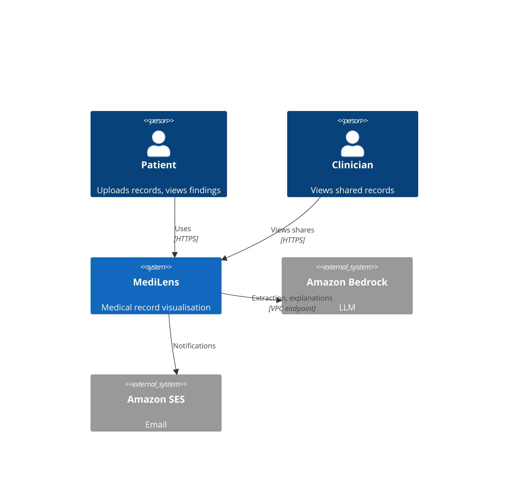
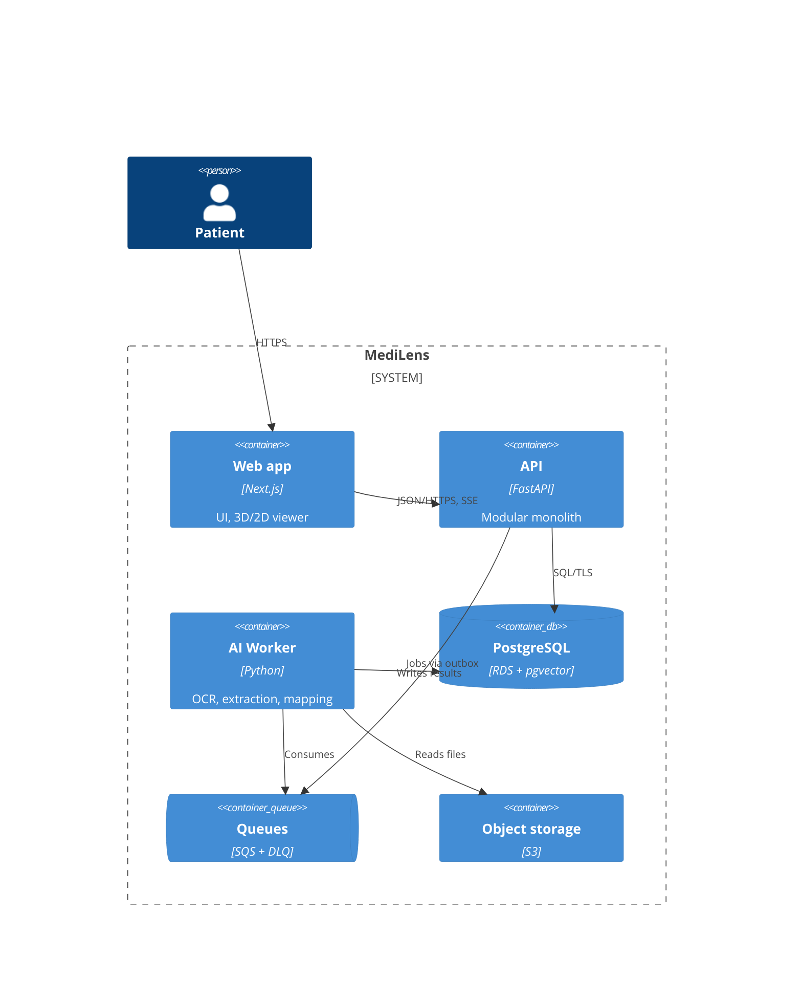

# C4 Diagrams (Mermaid)

## Level 1 — Context

```mermaid
C4Context
  Person(patient, "Patient", "Uploads records, views findings")
  Person(clinician, "Clinician", "Views shared records")
  System(medilens, "MediLens", "Medical record visualisation")
  System_Ext(bedrock, "Amazon Bedrock", "LLM")
  System_Ext(ses, "Amazon SES", "Email")
  Rel(patient, medilens, "Uses", "HTTPS")
  Rel(clinician, medilens, "Views shares", "HTTPS")
  Rel(medilens, bedrock, "Extraction, explanations", "VPC endpoint")
  Rel(medilens, ses, "Notifications")
```

## Level 2 — Containers

```mermaid
C4Container
  Person(patient, "Patient")
  System_Boundary(ml, "MediLens") {
    Container(web, "Web app", "Next.js", "UI, 3D/2D viewer")
    Container(api, "API", "FastAPI", "Modular monolith")
    Container(worker, "AI Worker", "Python", "OCR, extraction, mapping")
    ContainerDb(db, "PostgreSQL", "RDS + pgvector")
    ContainerQueue(q, "Queues", "SQS + DLQ")
    Container(s3, "Object storage", "S3")
  }
  Rel(patient, web, "HTTPS")
  Rel(web, api, "JSON/HTTPS, SSE")
  Rel(api, db, "SQL/TLS")
  Rel(api, q, "Jobs via outbox")
  Rel(worker, q, "Consumes")
  Rel(worker, s3, "Reads files")
  Rel(worker, db, "Writes results")
```
